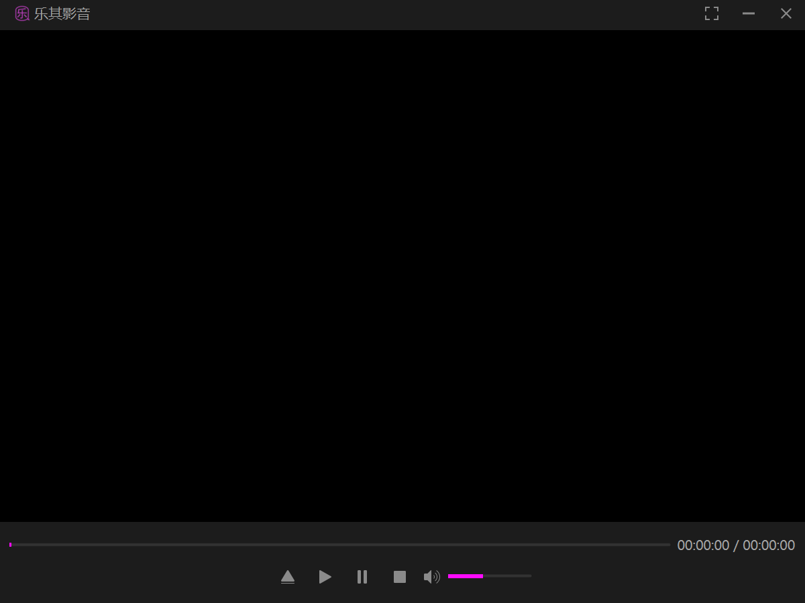
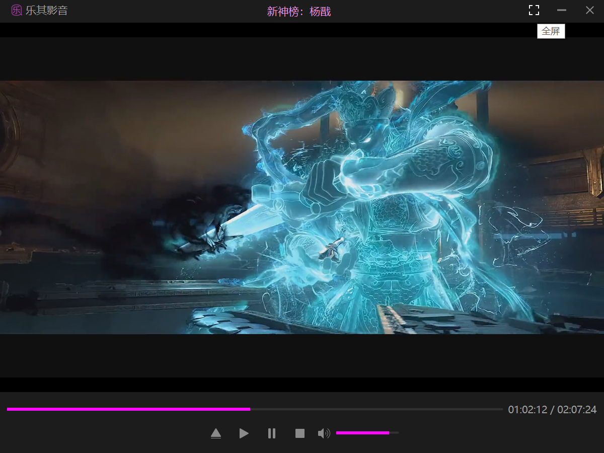

# 乐其影音

#### 介绍
乐其影音是一款音视频播放器，支持主流的音视频格式，详细可以参考Qt官方文档说明。

#### 软件架构
1. qt目录是用Qt实现的源码，其中widgets是指用QtWidgets实现的乐其影音的源码。

#### 安装教程

1.  本工程是在VS Code中创建和编写的。

#### 参与贡献

1.  Fork 本仓库
2.  新建 Feat_xxx 分支
3.  提交代码
4.  新建 Pull Request

#### 乐其影音windows桌面版截图

  
